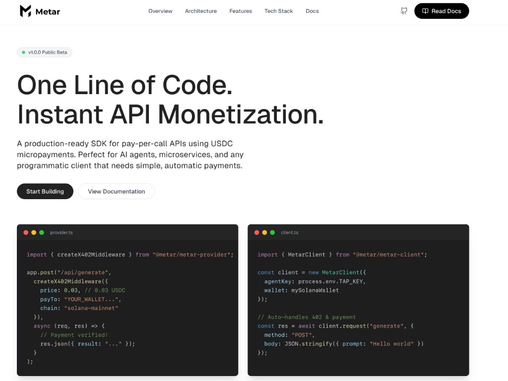

# Metar: x402 Payment Protocol SDK

**Pay-Per-Call SDK for the x402 Protocol**

[](https://opensource.org/licenses/MIT)

Metar is a complete SDK that enables pay-per-call APIs using the x402 payment protocol on Solana. It provides one-line middleware for providers and automatic payment orchestration for clients, eliminating the need for complex billing infrastructure.



## 🚀 Try It Now

**See Metar in action in under 2 minutes:**

```bash
# Clone and install
git clone <repository-url>
cd 402
npm install && npm run build

# Terminal 1: Start demo provider
cd packages/examples && npm run demo:provider

# Terminal 2: Run demo client
cd packages/examples && npm run demo:client -- --provider http://localhost:3000 --text "Hello, world!"
```

**🌐 [Website](https://metar-murex.vercel.app/)** - Official landing page and documentation
**📖 [Quick Start Guide](./QUICKSTART.md)** - Step-by-step tutorial  
**📖 [Technical Overview](./TECHNICAL_OVERVIEW.md)** - Architecture and implementation details  
**🤝 [Contributing](./CONTRIBUTING.md)** - How to contribute to this open source project

---

## Overview

Metar enables micropayment-protected APIs where clients pay per request using cryptocurrency. Built on Solana blockchain with USDC stablecoin, it provides a complete solution for providers to monetize API endpoints and for clients to make paid requests programmatically.

### Key Features

- 💰 **Micropayment Protocol**: Pay-per-request API access using USDC on Solana
- 🔐 **Trusted Agent Authentication**: Ed25519 signature-based authentication per Visa's TAP specification
- 🛡️ **Comprehensive Verification**: Payment validation, nonce checking, timestamp verification, and replay attack prevention
- 📊 **Usage Dashboard**: Real-time analytics and payment tracking with SQLite backend
- 🚀 **Production Ready**: Full E2E test suite, alignment verification, and battle-tested middleware
- 🔧 **Developer Friendly**: Simple SDK for both clients and providers with TypeScript support

## Architecture

```
┌─────────────────────────────────────────────────────────────┐
│                         CLIENT                              │
│  ┌──────────────────────────────────────────────────────┐  │
│  │ MetarClient (High-level SDK)                          │  │
│  │  • Price lookup                                      │  │
│  │  • Payment transaction creation                      │  │
│  │  • TAP signature generation                          │  │
│  │  • Automatic payment flow orchestration              │  │
│  └──────────────────────────────────────────────────────┘  │
└─────────────────────────────────────────────────────────────┘
                           │
                           ▼
         ┌─────────────────────────────────┐
         │  1. GET /.meter/price           │
         │  2. Send USDC transfer (Solana) │
         │  3. POST /api/route (+ headers) │
         └─────────────────────────────────┘
                           │
                           ▼
┌─────────────────────────────────────────────────────────────┐
│                        PROVIDER                             │
│  ┌──────────────────────────────────────────────────────┐  │
│  │ createX402Middleware (Express middleware)            │  │
│  │  • Parse payment headers                             │  │
│  │  • Verify timestamp (5 min max age)                  │  │
│  │  • Check nonce (prevent replay)                      │  │
│  │  • Verify TAP signature                              │  │
│  │  • Validate payment on-chain                         │  │
│  │  • Log usage to database                             │  │
│  └──────────────────────────────────────────────────────┘  │
└─────────────────────────────────────────────────────────────┘
                           │
                           ▼
         ┌─────────────────────────────────┐
         │  • Solana blockchain            │
         │  • Agent registry                │
         │  • Usage database (SQLite)       │
         └─────────────────────────────────┘
```

## Package Structure

This monorepo uses npm workspaces and contains the following packages:

### Core Packages

- **`packages/metar-client`** - Client SDK for making paid API requests
  - Wallet integration (browser & Node.js)
  - USDC payment transaction construction
  - TAP signature generation
  - Price lookup and caching
  - High-level `MetarClient` class

- **`packages/metar-provider`** - Express middleware for payment verification
  - x402 middleware with full verification pipeline
  - On-chain payment validation
  - TAP signature verification
  - Nonce management and replay protection
  - Usage tracking with SQLite

- **`packages/agent-registry`** - Agent key registry and price service
  - Agent public key storage and lookup
  - Price endpoint implementation
  - Route pricing configuration

### Supporting Packages

- **`packages/dashboard`** - Dashboard UI and backend for usage analytics
  - React frontend with Recharts visualizations
  - Express backend with SQLite
  - Real-time payment statistics
  - Route metrics and filtering

- **`packages/facilitator`** - Facilitator mode for delegated verification

- **`packages/examples`** - Complete demo implementation
  - Demo client showing full payment flow
  - Demo provider with protected endpoints
  - Comprehensive documentation

- **`packages/shared-types`** - Shared TypeScript types and interfaces
  - `PriceResponse`, `PaymentHeaders`, `UsageRecord`
  - `AgentKey`, `NonceRecord`, `PaymentMemo`
  - Full type safety across packages

- **`packages/shared-config`** - Shared configuration constants
  - Solana network configurations (devnet/mainnet)
  - USDC mint addresses
  - Connection utilities

## Getting Started

**🚀 New to Metar?** Start with the [Quick Start Guide](./QUICKSTART.md) for a step-by-step tutorial.

**⚡ Quick Demo**: See Metar in action:

```bash
# Terminal 1: Start provider
cd packages/examples && npm run demo:provider

# Terminal 2: Run client
cd packages/examples && npm run demo:client -- --provider http://localhost:3000 --text "Your text"
```

### Prerequisites

- **Node.js** >= 18.0.0 (v22+ recommended)
  - Note: Node.js v20.6.0+ and v22+ use `--import` instead of `--loader` flag
- **npm** >= 9.0.0
- **Solana CLI** (optional, for devnet testing)

### Installation

```bash
# Clone the repository
git clone <repository-url>
cd 402

# Install all dependencies
npm install

# Build all packages
npm run build
```

## Quick Start Examples

### For API Providers

Protect your Express endpoints with payment verification:

```typescript
import express from "express";
import { Connection } from "@solana/web3.js";
import { createX402Middleware } from "@metar/metar-provider";
import { createConnection, getUSDCMint } from "@metar/shared-config";

const app = express();
const connection = createConnection("devnet");

// Your agent registry implementation
const agentRegistry = {
  async lookupAgentKey(keyId: string) {
    // Return AgentKey or null
  },
};

// Protect your endpoint with payment
app.post(
  "/api/summarize",
  createX402Middleware({
    routeId: "summarize:v1",
    price: 0.03, // 0.03 USDC per request
    tokenMint: getUSDCMint("devnet").toString(),
    payTo: "YOUR_WALLET_ADDRESS",
    chain: "solana-devnet",
    connection,
    agentRegistry,
  }),
  async (req, res) => {
    // Payment verified! Access payment info via req.payment
    const summary = await summarizeText(req.body.text);
    res.json({ summary });
  }
);

app.listen(3000);
```

### For API Clients

Make paid API requests with the MetarClient:

```typescript
import { MetarClient, createNodeWallet } from "@metar/metar-client";
import { Connection, Keypair } from "@solana/web3.js";

// Setup
const connection = new Connection("https://api.devnet.solana.com");
const keypair = Keypair.generate();
const wallet = createNodeWallet(keypair);

// Create client
const client = new MetarClient({
  providerBaseURL: "https://api.example.com",
  agentKeyId: "my-agent-key",
  agentPrivateKey: keypair.secretKey, // Ed25519 key for TAP
  wallet,
  connection,
  chain: "solana-devnet",
});

// Make paid request (payment happens automatically)
const response = await client.request("summarize", {
  method: "POST",
  body: JSON.stringify({ text: "Your text here" }),
});

const result = await response.json();
console.log(result.summary);
```

## Running the Demo

See the complete working example in `packages/examples`:

```bash
# Terminal 1: Start demo provider
cd packages/examples
npm run demo:provider

# Terminal 2: Run demo client (with new wallet)
cd packages/examples && npm run demo:client -- --provider http://localhost:3000 --text "Text to summarize"

# Or use an existing wallet with --private-key flag
cd packages/examples && npm run demo:client -- --private-key <your-base58-or-base64-key> --provider http://localhost:3000 --text "Text to summarize"
```

The demo shows the complete payment flow including:

- Price lookup
- Payment transaction creation
- TAP signature generation (separate Ed25519 keypair)
- Payment verification
- Usage tracking

**Important Notes:**

- The demo generates a **separate TAP agent keypair** for signatures (not the Solana wallet key)
- Your wallet needs **SOL for transaction fees** and **USDC balance** in an associated token account
- Token accounts are automatically created if they don't exist

For detailed documentation, see [packages/examples/README.md](packages/examples/README.md).

## Development

### Building

```bash
# Build all packages
npm run build

# Build specific package
cd packages/metar-client
npm run build

# Watch mode for development
npm run build:watch
```

### Testing

```bash
# Run all tests
npm run test

# Run E2E integration tests
npm run test:e2e

# Skip integration tests (faster)
SKIP_INTEGRATION_TESTS=true npm run test
```

### Linting and Formatting

```bash
# Lint all packages
npm run lint

# Fix linting issues
npm run lint:fix

# Format code
npm run format

# Check formatting
npm run format:check
```

## How It Works

### Payment Flow

1. **Client requests price**: `GET /.meter/price?route=summarize:v1`
   - Returns: price, payTo address, mint, chain

2. **Client sends USDC transfer** on Solana blockchain
   - Includes memo with route and nonce
   - Waits for confirmation

3. **Client makes API request** with payment headers:
   - `x-meter-tx`: Transaction signature
   - `x-meter-route`: Route ID (e.g., "summarize:v1")
   - `x-meter-amt`: Payment amount
   - `x-meter-currency`: "USDC"
   - `x-meter-nonce`: Unique nonce (prevents replay)
   - `x-meter-ts`: Timestamp (max 5 min old)
   - `x-meter-agent-kid`: Agent key ID
   - `Authorization`: TAP signature

4. **Provider middleware verifies**:
   - ✅ Timestamp not expired (5 min max age)
   - ✅ Nonce not reused (prevents replay attacks)
   - ✅ TAP signature valid (authenticates agent)
   - ✅ Payment exists on-chain and confirmed
   - ✅ Payment amount matches price
   - ✅ Payment sent to correct recipient

5. **Provider processes request** and returns result

### Security Features

- **Replay Attack Prevention**: Nonces are tracked per agent and can only be used once
- **Timestamp Validation**: Requests expire after 5 minutes
- **Agent Authentication**: Ed25519 signatures per Trusted Agent Protocol
- **On-Chain Verification**: All payments validated against Solana blockchain
- **Idempotency**: Transaction signatures prevent double-spending

## Technical Specifications

### Payment Headers

All paid requests must include these headers:

```typescript
{
  "x-meter-tx": string;         // Solana transaction signature
  "x-meter-route": string;      // Route identifier (e.g., "summarize:v1")
  "x-meter-amt": string;        // Payment amount as string
  "x-meter-currency": "USDC";   // Currency code
  "x-meter-nonce": string;      // Unique nonce (UUID v7 recommended)
  "x-meter-ts": string;         // Unix timestamp in milliseconds
  "x-meter-agent-kid": string;  // Agent key ID
  "Authorization": string;      // TAP signature (see below)
  "Date": string;               // HTTP Date header
}
```

### TAP Signature Format

Authorization header follows Visa's Trusted Agent Protocol:

```
Authorization: Signature keyId="<agentKeyId>", alg="ed25519", headers="(request-target) date x-meter-nonce x-meter-tx", signature="<base64>"
```

Signature base string:

```
(request-target): post /api/summarize
date: Wed, 12 Nov 2025 12:00:00 GMT
x-meter-nonce: 01234567-89ab-cdef-0123-456789abcdef
x-meter-tx: 5j7s8K9mN0pQ1rS2tU3vW4xY5zA6bC7dE8fG9hI0jK1lM2nO3pQ4rS5tU6vW7xY8z
```

Signed with Ed25519 private key, base64-encoded.

### Error Responses

All payment-related errors return **402 Payment Required**:

```json
{
  "error": "Payment Required",
  "route": "summarize:v1",
  "amount": 0.03,
  "currency": "USDC",
  "payTo": "7xKXtg2...",
  "mint": "EPjFWdd5...",
  "chain": "solana-devnet",
  "message": "Payment verification failed",
  "tips": [
    "Ensure transaction is confirmed",
    "Check payment amount matches price",
    "Verify nonce is unique"
  ]
}
```

## Project Status

✅ **Production Ready** - Core features complete and tested:

- ✅ Client SDK with full payment flow
- ✅ Provider middleware with comprehensive verification
- ✅ TAP signature generation and verification
- ✅ Price lookup and caching
- ✅ Usage tracking with SQLite
- ✅ Dashboard with analytics
- ✅ E2E integration tests

## Package Details

Each package follows a consistent structure:

```
packages/<package-name>/
├── src/
│   ├── index.ts          # Main exports
│   └── ...               # Implementation files
├── dist/                  # Generated build output
├── package.json
├── tsconfig.json
└── tsup.config.ts         # Build configuration
```

## Contributing

1. Create a feature branch from `main`
2. Make your changes
3. Ensure all packages build: `npm run build`
4. Run tests: `npm run test`
5. Run linting: `npm run lint`
6. Submit a pull request

## Resources

- **Website**: [metar-murex.vercel.app](https://metar-murex.vercel.app/)
- **Technical Overview**: [TECHNICAL_OVERVIEW.md](./TECHNICAL_OVERVIEW.md)
- **Quick Start Guide**: [QUICKSTART.md](./QUICKSTART.md)
- **Examples Documentation**: [packages/examples/README.md](packages/examples/README.md)
- **Trusted Agent Protocol**: [Visa TAP Specification](https://github.com/visa/trusted-agent-protocol)

## License

See LICENSE file for details.
